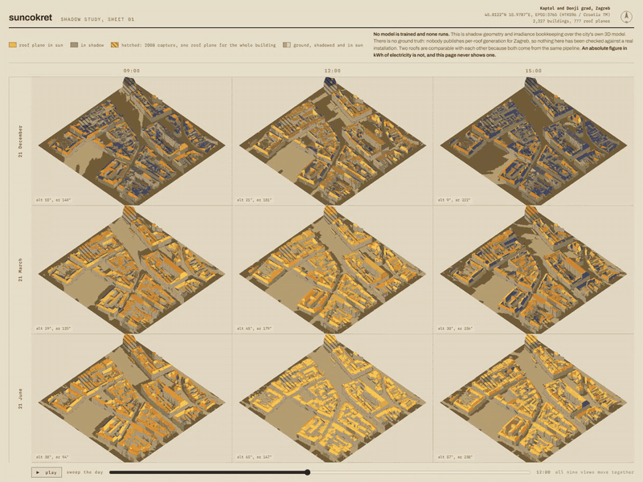

# suncokret

A shadow study of Zagreb roofs, from the city's own 3D model.

[](https://github.com/markolivaic/suncokret/actions/workflows/ci.yml)

## What this is

Nine views of the same few blocks of Zagreb: three times of day across, three
dates of the year down, with every roof plane drawn from the real LoD 2.2 city
model and coloured by whether the sun is actually reaching it. One control
sweeps the day and all nine move together. Click any roof and its whole year
appears underneath as an hour-by-day carpet.

The part it exists for is the third one. A roof's tilt and azimuth are easy, and
every solar calculator has them. What they skip is the block across the street.
PVGIS already applies a far horizon from a terrain model, but buildings are not
in it, so a roof that loses every winter morning to its neighbour scores the
same as one with open sky. This computes that difference from the geometry.

**No model is trained and none runs.** This is shadow geometry, solar position
from closed-form astronomical series, and irradiance bookkeeping. There is no
machine learning in it anywhere.

## What this is not

**It does not tell you how much electricity your roof would make.** There is no
ground truth for any roof in Zagreb. Nobody publishes per-roof generation, so
nothing here has been checked against a real installation, and it never will be
by this repository. Two roofs are comparable with each other because both sides
of the comparison come from the same pipeline. An absolute annual figure in kWh
of electricity is not, and the interface never shows one.

**The city model is not uniform, and half of it is coarse.** Of the 357,683
buildings in ZG3D, 194,967 (54.5%) come from a 2008 aerial photogrammetry
capture with a median of 6 faces per building, and 161,872 (45.3%) come from the
2022 multisensor capture with a median of 72. In the 2008 population 56% of
buildings carry exactly one roof plane for the entire roof. For those, this shows
the shape of a roof rather than that roof, and says so on the building itself:
they are drawn hatched, and the hatch follows through onto the carpet.

**It is a few blocks, not the city.** The published bundle covers a 260 m square
from Trg bana Jelačića down to Zrinjevac. The pipeline runs anywhere in the
dataset; what is committed is one district, because that is what fits in a
repository.

## Walkthrough

[](docs/walkthrough/app-walkthrough.mp4)

[Full-resolution H.264 recording](docs/walkthrough/app-walkthrough.mp4), and the
[poster frame](docs/walkthrough/app-walkthrough-poster.jpg).

One uninterrupted recording of the running application at 1600 by 1200. Play
sweeps a whole day and all nine views move together, so the December row goes
dark while June is still lit. Every state transition is rendered by the running
application. No screen is mocked.

## Why this exists

I wrote the shadow geometry once before, for a 48 hour hackathon project called
[sada](https://github.com/markolivaic/sada), which used SunCalc and Turf.js over
the same Zagreb LiDAR to tell you which cafe terrace was in the sun. It worked.
I wanted to know what that machinery is worth pointed at a decision that costs
money instead of at where to have coffee.

Zagreb is the one place I can get this data. ZG3D is published under an open
licence with real roof planes in it, which most cities do not do, and I can check
the answers against streets I have walked down.

## How it works

    data.zagreb.hr           ZG3D 2022, file geodatabase, Esri multipatch
        |
        |  scripts/fetch_zg3d.py
        v
    backend/suncokret/wkb.py         normalise the WKB flavours GDAL emits
    backend/suncokret/roofs.py       rings -> oriented planes, tilt, azimuth
        |
        |                    re.jrc.ec.europa.eu  PVGIS hourly, one call
        |                        |  scripts/fetch_pvgis.py
        v                        v
    backend/suncokret/shading.py     horizon profile per plane
    backend/suncokret/sun.py         solar position
    backend/suncokret/irradiance.py  transpose, block beam, reduce diffuse
        |
        |  scripts/build_district.py
        v
    web/public/district/*.json + .bin
        |
        v
    web/src  three.js, nine scissored viewports over one scene

Three decisions are worth naming because they were not obvious.

**Orientation comes from the highest face, not from the volume.** A roof plane
and the floor slab under it are both horizontal, so forcing normals upward turns
a floor into a second roof and doubles a building's usable area. The winding
carries the answer, but the usual way to read it, the sign of the
divergence-theorem volume, only works for a closed surface, and 54% of ZG3D is
open shells with no floor whose signed volume misses the dataset's own `Volume`
attribute by a median factor of 14.8. So orientation is taken from the highest
non-vertical face of each building, which needs no closure. On the closed solids,
where the volume sign can be checked and is right, the two rules agree.

**Blockers below the observer are discarded, which is exact.** The horizon is
only ever consulted at positive sun elevations, so a neighbour lower than your
roof cannot take anything from you. Dropping those points is not an
approximation and it is most of why a district is minutes rather than hours.

**Beam and diffuse are shaded differently.** A block either blocks the sun or it
does not, so beam is switched off hour by hour. Diffuse arrives from the whole
sky and is reduced by however much sky that block covers, in every hour
including overcast ones. Treating diffuse as unobstructed is the usual shortcut
and it flatters a shaded roof badly in a Zagreb winter.

## Quick start

The app is static and the district bundle is committed, so nothing has to be
downloaded or built to see it work.

```bash
cd web && npm ci && npm run dev
```

Open the URL it prints. No API key, no backend, no account.

To rerun the pipeline instead of trusting the committed bundle, see
[Verification](#verification).

## Reference

### Scripts

| Script | What it does | Writes |
|---|---|---|
| `scripts/fetch_zg3d.py` | Downloads the ZG3D file geodatabase, ~329 MB | `data/raw/` |
| `scripts/fetch_pvgis.py` | One PVGIS call, hourly components for Zagreb | `data/pvgis/` |
| `scripts/survey_roofs.py` | Sweeps all 357,683 buildings, reports what survives | `data/survey/roof_survey.json` |
| `scripts/validate_sun.py` | Checks solar position against PVGIS hour by hour | `data/survey/sun_validation.json` |
| `scripts/benchmark_shading.py` | Cost and effect of shading over four districts | `data/survey/shading_benchmark.json` |
| `scripts/build_district.py` | Builds the bundle the web app reads | `web/public/district/`, `data/survey/district_build.json` |

Every number in this README comes from one of those files. `tests/integrity`
fails the build if any of them drifts.

### Modules

| Module | Responsibility |
|---|---|
| `suncokret.wkb` | Repair the ISO TIN records shapely refuses, moving no coordinate |
| `suncokret.roofs` | Rings to oriented planes: area, tilt, azimuth, centroid |
| `suncokret.sun` | Solar position, vectorised over time |
| `suncokret.shading` | Horizon profiles, sky view factors, the blocker index |
| `suncokret.irradiance` | Transposition onto a plane, with beam and diffuse shaded apart |

## Verification

### What has been measured

**Roof geometry, across every building.** All 357,683 swept in 261 s, one row
each, including the ones that fail:

| | buildings | share |
|---|---|---|
| pitch and azimuth recoverable | 354,927 | 99.23% |
| more than a flat top | 257,792 | 72.07% |
| enough roof for a domestic install | 231,218 | 64.64% |

The extraction is checked against ZG3D's own attributes rather than asserted. On
the 163,283 closed solids, the sum of computed face areas matches the dataset's
`SArea` to a median relative error of **2.8e-06**, with 98.8% inside 1%. 36.7% of
all 23,767,453 faces have zero area and are discarded; 671 buildings ship
geometry shapely will not parse and are repaired; 148 have no non-vertical face
and their orientation is left undecided rather than guessed.

**Solar position, against PVGIS.** PVGIS reports the sun elevation it used for
every hour. Over 4,289 daylight hours of 2020 this project's own figure agrees to
**RMS 0.204°, maximum 0.425°**, at the raw timestamp with no offset fitted.

**The JavaScript port, against the Python.** `web/src/sun.ts` is a port of
`backend/suncokret/sun.py`. 140 cases spanning four latitudes and five dates are
generated by the Python module, committed, and checked in CI to 1e-6 degrees, so
the browser and the builder cannot drift apart.

**Shading cost and effect, over four real districts.** 7.5 to 34.4 ms per
building depending on density. In dense Donji grad blocks the mean roof keeps
0.892 of its direct beam, the worst tenth keep 0.733 or less, and the worst keeps
0.486. Suburban Sesvete: mean 0.926, worst 0.543. Travno, the tall socialist
slabs, keeps 0.994, because a roof on top of the tallest thing around has nothing
to shade it. That was the opposite of what I expected and the measurement is left
in.

Both approximations are measured, not asserted. A 1 m blocker height field moves
the beam a roof keeps by 0.003 on average against the undecimated cloud; 5 m
moves it by 0.034. A 250 m search radius differs from a 500 m one by 0.0005.

### Reproducing it

Development is on Windows and CI is on Linux, so activate the environment
rather than reaching into it by path.

```bash
python -m venv .venv
. .venv/bin/activate          # Windows: .venv\Scriptsctivate
pip install -e "backend[dev]"
python scripts/fetch_zg3d.py      # ~329 MB, a few minutes
python scripts/fetch_pvgis.py     # a few seconds
python scripts/survey_roofs.py    # ~3 minutes, resumable
python scripts/validate_sun.py
python scripts/benchmark_shading.py
python scripts/build_district.py  # ~5 minutes
```

The walkthrough is recorded off the running page rather than staged. The page
sweeps a whole day on its own play button, so the recording is one take of that
and there is no scenario to write:

```bash
cd web && npm run record:walkthrough
```

### Tests

```bash
pytest tests/unit         # behavioural
pytest tests/integrity    # the numbers above still match their artefacts
cd web && npm test        # the port still matches Python
```

Counted separately, and CI counts them separately too: **76 behavioural** and
**145 frontend** tests, plus the integrity suite.

## Limitations

- **No ground truth, and there will not be any.** Stated above the fold because
  it is the first thing that matters, not the last.
- **Self-shading is coarse.** A roof plane's own building is in its blocker set,
  which is right for a dormer and wrong for the plane's own edge. Blockers
  nearer than 1.5 m are dropped, which handles the worst of it, but a proper fix
  would separate self-shading from the neighbours.
- **Reflected irradiance is not shade-corrected.** It is a few per cent of the
  total and correcting it would need a model of what the neighbours are made of.
- **The sky is isotropic.** An anisotropic model puts more diffuse near the sun
  and would change the answer for a roof shaded to the south specifically.
- **One year of weather.** 2020, from PVGIS SARAH3. A different year moves every
  absolute figure and moves the comparisons very little.
- **Vegetation is ignored.** ZG3D ships trees; this uses only buildings, so a
  roof under a large tree is scored as if the tree were not there.
- **The bundle samples one point per roof plane.** Against five points the
  difference is 0.0006 on average and 0.020 at worst, measured on every build
  and reported in `data/survey/district_build.json`.

## References

- ZG3D 2022, 3D model of the City of Zagreb, Grad Zagreb, Otvorena dozvola.
  https://data.zagreb.hr/dataset/zg3d-2022-3d-model-gz
- PVGIS, European Commission Joint Research Centre.
  https://re.jrc.ec.europa.eu/
- NOAA Solar Calculator, the abridged Meeus series this implements.
  https://gml.noaa.gov/grad/solcalc/
- Full attribution and what was done to each dataset:
  [THIRD_PARTY_NOTICES.md](THIRD_PARTY_NOTICES.md)

## License

MIT, see [LICENSE](LICENSE). The data keeps its own licences, listed in
[THIRD_PARTY_NOTICES.md](THIRD_PARTY_NOTICES.md).
